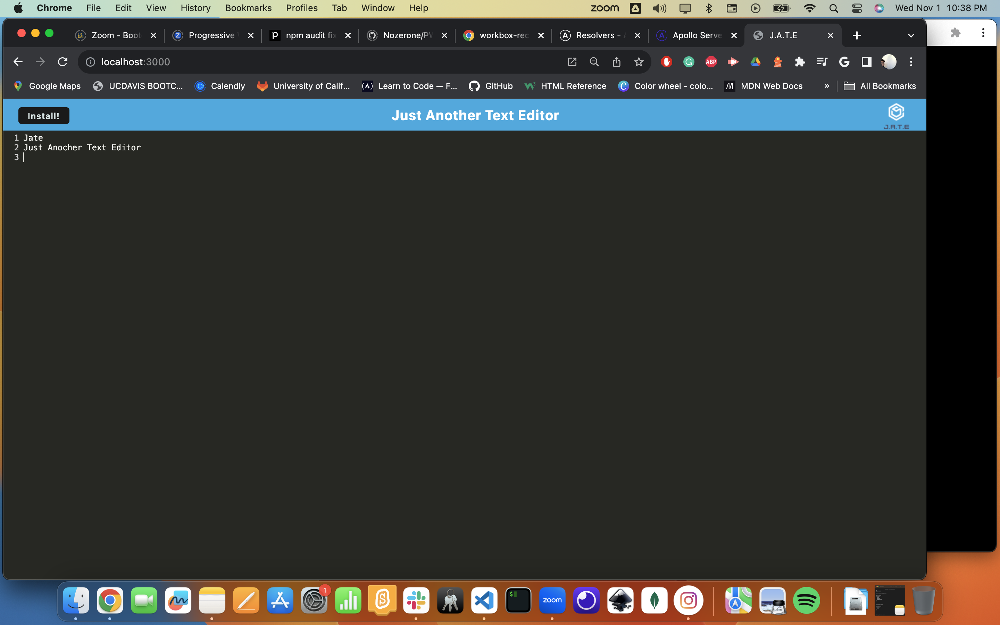

# PWA_Text_Editor
Jate Just Another Text Editor

## Description
This is a single page application that meets WPA criteria. This app features a number of data persitense techniques that serve as a reduncancy in case one of the options is not supported by the browser. This applications works offline.

## Table of Contents
* [Installation](#installation)
* [Usage](#usage)
* [Contribute](#contribute)
* [License](#license)
* [Author](#author)
* [gitHub](#github)
* [Credits](#credits)
* [Email](#email)

## Installation 
true 

## Usage 
Clone the app repo from github. Do an `npm install`. 
Run `npm start`. The application will start and serve the client.

## Contribute 
Email the developer with feedback

## License 
This application is covered under OpenSource license

## Project Author 
Jose Posadas 

### gitHub repo
[PWA Text Editor](https://github.com/Nozerone/PWA_Text_Editor)

### Credits 
N/A 

### Email 
posadas79@gmail.com

### Demo
N/A

### Screenshot

# pwa_jate
